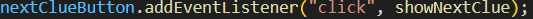

# WANDERER. 
Travel-themed quiz designed to test players' knowledge of countries, famous personalities, landmarks, and traditional dishes from around the world. The core objectives are:

#### Educational Experience: Players learn about different countries, their iconic landmarks, famous individuals, and culinary traditions.
#### Engagement & Fun: The game combines quiz elements with images, fun facts, and interactive gameplay to keep the user engaged.
#### Score-Based Progression: Players advance by answering clues correctly, with the goal of accumulating points and completing rounds.

## Theme: The game’s theme revolves around travel and global exploration, offering players a virtual journey across various countries by connecting them with local dishes, notable personalities, and famous landmarks. The theme emphasizes both cultural discovery and geography.

# Main Page Visualization

# General Design and Logic 

### 1. User Interface (UI) Design:
* Responsive Design: The game should be responsive to different screen sizes, providing a good user experience on both desktop and mobile devices.
* Visual Appeal: Images of dishes, people, and landmarks are important for user engagement. The design must maintain consistency and clarity in displaying these visuals.
* Feedback System: Visual and audio feedback after each guess (correct or incorrect) is necessary to keep users motivated and informed.
### 2. Gameplay Functionality:
* Clue Display: The game should randomly display clues (dish, person, or place) with corresponding images and titles.
* Progress Tracking: The game should track the user’s score and the round they’re on, providing progression indicators.
* Answer Checking: The game should check the user’s input against the correct answer (country) and give feedback accordingly.
Sound Effects: Correct and incorrect sounds enhance the experience, providing audio feedback for the player’s actions.
### 3. Content Management:
* Diverse Content: A collection of clues (countries, dishes, landmarks, people, and fun facts) should be sufficiently diverse and informative, ensuring players learn while playing.
* Flag Images: Flag images for each country should be available to display after correct answers

## Event Handlers and logical descriptions

Purpose: This event handler is triggered when the user clicks the "Submit Answer" button.
Functionality: It checks the user's input (the country they think is associated with the clue) against the correct answer (the actual country). If the answer is correct, it updates the score, provides feedback, plays a "correct" sound, and moves to the next clue. If the answer is incorrect, it plays a "wrong" sound and displays incorrect feedback, prompting the user to try again.
Flow:
* Grabs the user's input.
* Compares it with the correct answer.
* Displays feedback based on the result.
* Updates the score and proceeds to the next clue after a delay.

Purpose: This event handler is activated when the user clicks the "Pass Question" button.
Functionality: When the user chooses to skip the current clue, this event handler handles the skip logic by displaying a message indicating the question was skipped and moves to the next clue.
Flow:
* Displays feedback saying "Question skipped!".
* Moves to the next clue after a short delay, ensuring the game continues without interruption.

Purpose: This event handler is triggered when the user clicks the "Next Clue" button.
Functionality: It allows the user to proceed to the next stage of the current clue (from dish to person or from person to place). If the current stage is not the last one (place), it advances the clue by incrementing the currentStage variable and updates the display to show the next piece of the clue.
Flow:
* Checks if the user is not on the last clue stage.
* Increases the currentStage to move to the next clue type.
* Updates the display (image and title) to reflect the new clue information.
These event handlers are key in controlling the user interaction with the game, allowing them to check answers, skip questions, and navigate through the stages of each clue.

## Closure Benefits
### Managing Game State
* Closures help maintain and update the game state (like currentClueIndex, score, round, and currentStage) throughout the game without having to pass these variables explicitly between functions.

### Storing Feedback and Sound Preferences
* Closures also help in maintaining persistent feedback or sound across different parts of the game.

## DOM-Interactions

### Event Listeners
I set up event listeners to detect user actions (such as clicking buttons) and trigger the corresponding game logic. For example:
* Button Clicks: I add event listeners to buttons that allow the user to interact with the game. These buttons are used for actions like submitting an answer, passing a question, or navigating between clues

### Style Changes
I also interact with the DOM by dynamically updating the styles of elements, particularly to give visual feedback to me. For example:
* Changing Feedback Style: When the answer is correct or incorrect, I modify the color and opacity of the feedback element to provide visual cues

## *** AI-Interactions and References/Links ***

[ChatGPT to discuss and improve the game ]([https://pages.github.com/](https://chatgpt.com/c/6755b713-c790-8006-a440-46c8a710c5da))

